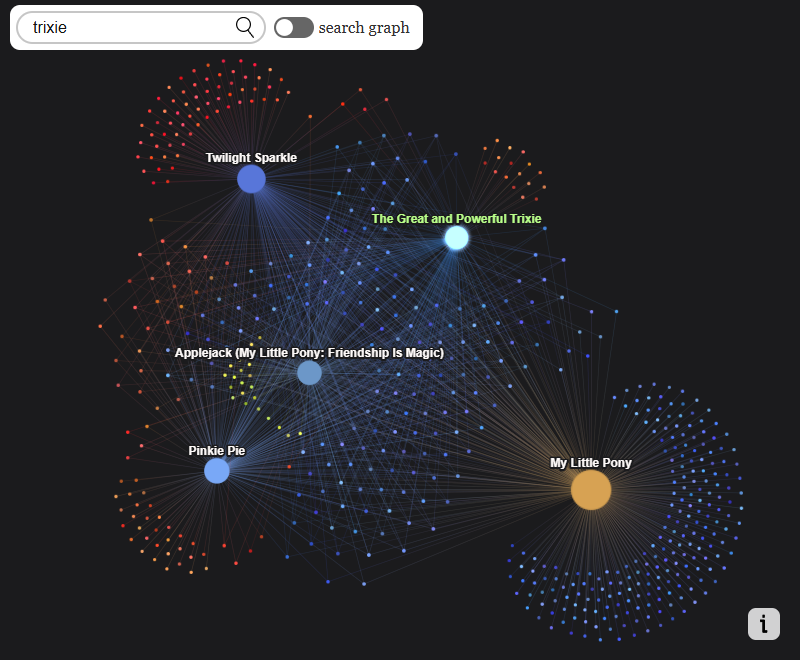

# ya-wiki-graph

*yet another Wikipedia graph*



This is an app that visualizes Wikipedia pages using a [force-directed graph.](https://en.wikipedia.org/wiki/Force-directed_graph_drawing) Each circle is a Wikipedia page.

Click on a circle to see links a page has to other pages. Hold to open the actual Wikipedia page.

# How to run
Use any static web server to serve this directory. I personally use [http-server](https://www.npmjs.com/package/http-server) and do
```
> http-server . -c-1 -p6969
```

# How to build

```
> npm run tsc
```

or if you are on Windows

```
> build.bat
```

# License

This project is under MIT License.

[Wikipedia language icon](https://commons.wikimedia.org/wiki/File:OOjs_UI_icon_language-ltr-progressive.svg) used under MIT license. See THIRD_PARTY_LICENSES for details.

